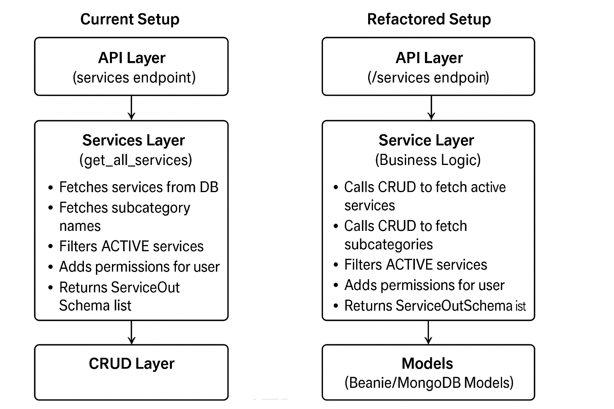

# Technical Debt

This document provides decisions that have been made but contributed to Technical debt.

---

My current backend Architecture (FastAPI)

├─ Routes & APIs # route handlers 
├─ Services / Business Logic 
├─ CRUD Layer # interacts with Models for DB operations 
└─ Integrations # Stripe, Addressable.dev, Cloudflare R2. 


My services which contains the business logic also contain the Crud

You mentioned that your Services layer currently contains the CRUD logic. Here’s what that implies:

Services / Business Logic

Ideally, this layer handles application rules, validations, workflows, calculations, and orchestration of multiple operations.

Example: When a user books a service, you might check availability, calculate a fee, and send notifications.

CRUD Layer

This layer is specifically meant for direct database interactions—Create, Read, Update, Delete—without embedding business rules.

Example: create_booking(), get_user_by_email(), update_service_status().

What it means if CRUD is in Services

Your Services layer is currently doing two jobs at once: handling business rules and interacting with the database.

This is fine for small apps, but it can make testing, maintenance, and scaling harder.

Pros: Fewer files, simpler to follow initially.

Cons: Tightly coupled logic and DB code → harder to reuse, mock, or replace DB later.

Routes / APIs

These should only handle HTTP requests, validate input, call the service layer, and return responses.

They shouldn’t talk to the database directly.

Best practice suggestion:

Routes (API) --> Services (Business Logic) --> CRUD Layer (DB operations) --> Models

- API layer: receives request → calls service

- Service layer: executes business logic → calls CRUD functions

- CRUD layer: only talks to DB → returns raw data to service

- Integrations: external services called from Services when needed (e.g., Stripe payment)

If your services currently include CRUD, you could refactor by extracting DB calls into a separate CRUD module, keeping your services focused on orchestration and rules.

I can draw a quick visual hierarchy showing your current vs. refactored setup if you want—it will make it clearer where CRUD belongs.

```
My Services API Router 


"# ==================== PUBLIC ENDPOINTS ====================

@router.get("/services", response_model=List[ServiceOutSchema])
async def get_services(
        current_user: Optional[UserRead] = Depends(current_user_optional)
) -> List[ServiceOutSchema]:
    """
    Get all active services (public endpoint).

    ✅ ENHANCED: Now includes permissions if user is authenticated
    ✅ PRESERVED: Same response structure
    """
    return await Crud.get_all_services(current_user)" 
    
    
    ```


My services Service Layer + Crud 

```

async def get_all_services(current_user: Optional[UserRead] = None) -> List[ServiceOutSchema]:
    """
    Fetch all services from the database.

    ✅ ENHANCED: Only shows ACTIVE services to public, adds permissions
    ✅ PRESERVED: All existing lookup logic
    """
    # ✅ NEW: Only show active services for public listing
    services = await Services.find({"status": ServiceStatus.ACTIVE}).to_list()

    service_out_list = []
    for service in services:
        # Initialize subcategory_name to None or a default value
        subcategory_name = None

        # 1. Check if a subCategoryId exists on the service object
        if service.subCategoryId:
            # 2. Find the SubCategory document by its ID
            found_subcategory = await SubCategories.get(service.subCategoryId)

            if found_subcategory:
                # 3. Get the name from the found subcategory object
                subcategory_name = found_subcategory.subCategoryName

        # Create a dictionary from the service model
        service_dict = service.model_dump()

        # 4. Inject the subcategory name into the dictionary
        service_dict['subCategoryName'] = subcategory_name

        # ✅ NEW: Add permissions if user provided
        if current_user:
            permissions = await PermissionService.get_service_permissions(current_user, service)
            service_dict.update(permissions.dict())

        # Validate and append the service to the output list
        service_out_list.append(ServiceOutSchema(**service_dict))

    return service_out_list

```

Breaking down the above Current Architecture using the 

1. API Layer
@router.get("/services", response_model=List[ServiceOutSchema])
async def get_services(
        current_user: Optional[UserRead] = Depends(current_user_optional)
) -> List[ServiceOutSchema]:
    return await Crud.get_all_services(current_user)


This is just the route that the client hits.

Responsibilities:

Expose the HTTP endpoint (/services)

Optionally get the current user

Call the business logic or CRUD layer (Crud.get_all_services)

Good: It doesn’t do DB queries itself; it delegates.


2. Services Layer (your get_all_services)
async def get_all_services(current_user: Optional[UserRead] = None) -> List[ServiceOutSchema]:
    services = await Services.find({"status": ServiceStatus.ACTIVE}).to_list()
    ...
    for service in services:
        ...
        if service.subCategoryId:
            found_subcategory = await SubCategories.get(service.subCategoryId)
            if found_subcategory:
                subcategory_name = found_subcategory.subCategoryName
        service_dict = service.model_dump()
        if current_user:
            permissions = await PermissionService.get_service_permissions(current_user, service)
            service_dict.update(permissions.dict())
        service_out_list.append(ServiceOutSchema(**service_dict))
    return service_out_list


What’s happening here:

Fetching from the DB:
services = await Services.find(...).to_list() → direct database query. This is actually CRUD logic, not just business logic.

Business logic / enrichment:

Filtering only ACTIVE services → could be considered business logic.

Adding subcategory name → enriching the response.

Adding permissions for current user → business logic.

Serialization:
ServiceOutSchema(**service_dict) → shaping the data for API response.

3. Mixing CRUD and Services

Right now, your get_all_services is doing both:

CRUD (DB queries):

Services.find(...)

SubCategories.get(...)

Business logic:

Filtering by status

Adding subcategory name

Adding permissions

✅ Why this matters:

It works, but tightly couples DB access and business logic.

Harder to test get_all_services without a database.

If you switch DB or caching later, you’ll have to rewrite the service logic.

4. Refactoring Recommendation

You could split like this:

CRUD Layer – simple DB operations:

class ServiceCRUD:
    @staticmethod
    async def get_active_services() -> list:
        return await Services.find({"status": ServiceStatus.ACTIVE}).to_list()

    @staticmethod
    async def get_subcategory(subcategory_id):
        return await SubCategories.get(subcategory_id)


Service Layer – orchestration and enrichment:

async def get_all_services(current_user: Optional[UserRead] = None):
    services = await ServiceCRUD.get_active_services()
    service_out_list = []

    for service in services:
        subcategory_name = None
        if service.subCategoryId:
            found_subcategory = await ServiceCRUD.get_subcategory(service.subCategoryId)
            if found_subcategory:
                subcategory_name = found_subcategory.subCategoryName

        service_dict = service.model_dump()

        if current_user:
            permissions = await PermissionService.get_service_permissions(current_user, service)
            service_dict.update(permissions.dict())

        service_out_list.append(ServiceOutSchema(**service_dict))

    return service_out_list


✅ Benefits:

Services focus on business rules and response shaping.

CRUD layer can be reused elsewhere and easily tested independently.

Cleaner separation of concerns.


Current Setup

API Layer (/services endpoint)
        │
        ▼
Services Layer (get_all_services)
        ├─ Fetches services from DB       <-- CRUD logic mixed in
        ├─ Fetches subcategory names      <-- CRUD logic mixed in
        ├─ Filters ACTIVE services        <-- Business logic
        ├─ Adds permissions for user      <-- Business logic
        └─ Returns ServiceOutSchema list

Problem: DB access (CRUD) is mixed into business logic.

Refactored Setup

API Layer (/services endpoint)
        │
        ▼
Service Layer (Business Logic)
        ├─ Calls CRUD to fetch active services
        ├─ Calls CRUD to fetch subcategories
        ├─ Filters ACTIVE services
        ├─ Adds permissions for user
        └─ Returns ServiceOutSchema list
        │
        ▼
CRUD Layer (Database Access Only)
        ├─ get_active_services() → fetches from Services collection
        └─ get_subcategory(subcategory_id) → fetches from SubCategories collection
        │
        ▼
Models (Beanie/MongoDB Models)


Benefits of Refactor:

Service layer orchestrates logic but does not touch the DB directly.

CRUD layer handles all DB operations → easier to swap databases or add caching.

API layer only handles request/response → very thin and testable.

